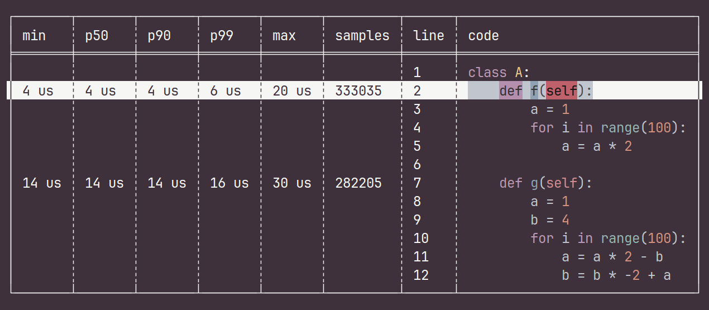

# downtown

A realtime BPF profiler.

```
cargo install downtown
```



v0.1.0 - supports Python.

## Usage
- `./downtown src/mycode.py`: monitor all python processes (`/usr/bin/env python`)
- `./downtown src/mycode.py --pid 123`: monitor /proc/123/exe
- `./downtown src/mycode.py --python-bin ./python`: monitor a python binary
- up, down - scroll
- enter - toggle

## Requirement
- libelf (Ubuntu: apt install libelf-dev)
- Python built with --with-dtrace
    - on Linux, verify with `readelf -S ./python | grep .note.stapsdt`
